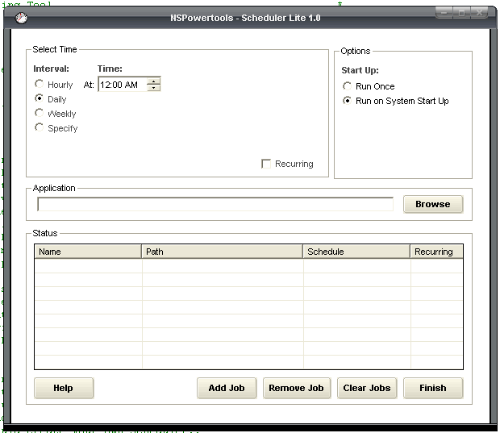



## Updated\! Task Master

### Description

A replacement scheduler tool for windows.. I recently noticed the scheduler is effectively broken in XP (SP2). You now require a logon to schedule a task, and applications scheduled as System with netapi or wmi, are no longer starting. So, I made my own scheduler! This runs with almost no overhead, can schedule multiple simultaneous tasks by hour/day/week/month. Can schedule recurring jobs, and is completely accessable from a command line. This should also run on all operating systems, (let me know..). Well, hope ya like it.. Comments/suggestions are welcome..

----

Updated - Consolidated code into one reusable class. Tightened it up in a few spots, and changed clock display format to 12 hour- AM/PM for clarity.

----

Version 1.3 is up!

Fixed a few problems, added a system tray menu. Skinned the app with Neo Lite.

Enjoy..

Cheers,

John
 
### More Info
 

             |
---                |---
**Submitted On**   |2006-03-30 23:20:10
**By**             |[Steppenwolfe](https://github.com/Planet-Source-Code/PSCIndex/blob/master/ByAuthor/steppenwolfe.md)
**Level**          |Intermediate
**User Rating**    |5.0 (35 globes from 7 users)
**Compatibility**  |VB 5\.0, VB 6\.0
**Category**       |[Complete Applications](https://github.com/Planet-Source-Code/PSCIndex/blob/master/ByCategory/complete-applications__1-27.md)
**World**          |[Visual Basic](https://github.com/Planet-Source-Code/PSCIndex/blob/master/ByWorld/visual-basic.md)
**Archive File**   |[Updated\!\_T1984233302006\.zip](https://github.com/Planet-Source-Code/steppenwolfe-updated-task-master__1-64267/archive/master.zip)

